# Frontend Mentor - E-commerce product page solution

`Typescript` `React` `React Router` `Vite` `Zustand` `SCSS`

 

🚀 Live Site URL: [E-commerce by oodhmo](https://sneakers-by-oodhmo.netlify.app/men/detail/sn-001)

 Challenge Page: [E-commerce product page challenge on Frontend Mentor](https://www.frontendmentor.io/challenges/ecommerce-product-page-UPsZ9MJp6)

 

> 🗒️ This README is written in Korean.  
> For non-Korean readers, please use a browser translator (e.g. Google Translate) for best results.

 

프론트엔드 멘토 챌린지 기반으로 구현한 E-commerce 제품 상세 페이지입니다.

챌린지의 목적은 디테일 페이지 구현에 집중되어 있으나
향후 메인 페이지 및 카테고리 페이지로의 확장을 고려해  
데이터를 추가하고 Router를 활용한 페이지 네비게이션을 구현했습니다. (현재 비활성화)

 

## Table of contents

- [🧭 Overview](#🧭-overview)
  - [The challenge](#the-challenge)
  - [Screenshot & Features](#screenshot--features)
- [🛠️ My process](#🛠️-my-process)
  - [Built with](#built-with)
  - [What I learned (배운 점과 고민)](#what-i-learned-배운-점과-고민)
  - [Continued development (앞으로의 개발 계획)](#continued-development-앞으로의-개발-계획)
  - [Useful resources (참고 자료)](#useful-resources-참고-자료)
- [🧠 Acknowledgments](#🧠-acknowledgments)

 

## 🧭 Overview

 

### The challenge

Users should be able to:

- View the optimal layout for the site depending on their device's screen size
- See hover states for all interactive elements on the page
- Open a lightbox gallery by clicking on the large product image
- Switch the large product image by clicking on the small thumbnail images
- Add items to the cart
- View the cart and remove items from it

 

### Screenshot & Features

 

#### Responsive design

- Mobile/Tablet: 0px ~ 825px
- Small Desktop: 826px ~ 1147px
- Standart Desktop: 1148px ~ 1399px
- XL Desktop: 1400px ⬆️

#### -Desktop-

<strong>Product Detail Page(상세 페이지)</strong>

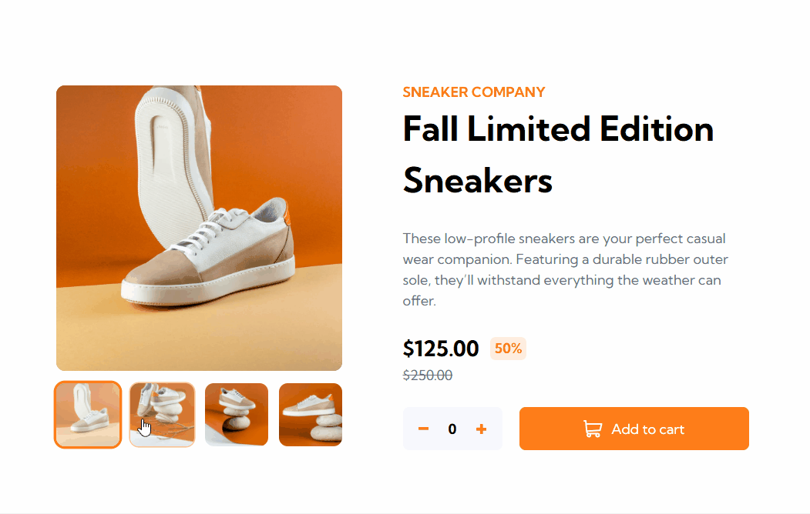

- Dynamic Image Loading: Custom image loader hook을 활용해 상품 이미지를 동적으로 import하도록 구성
- Thumbnail–Main Sync: 선택된 이미지 index를 기반으로, 썸네일 리스트와 메인 이미지 간 상태 동기화를 props를 통해 구현
- Reusable Image Slider: 다양한 상황에서 재사용할 수 있도록 이미지 슬라이더 UI를 컴포넌트로 분리 및 최적화

 

<strong>Cart Popup(장바구니)</strong>

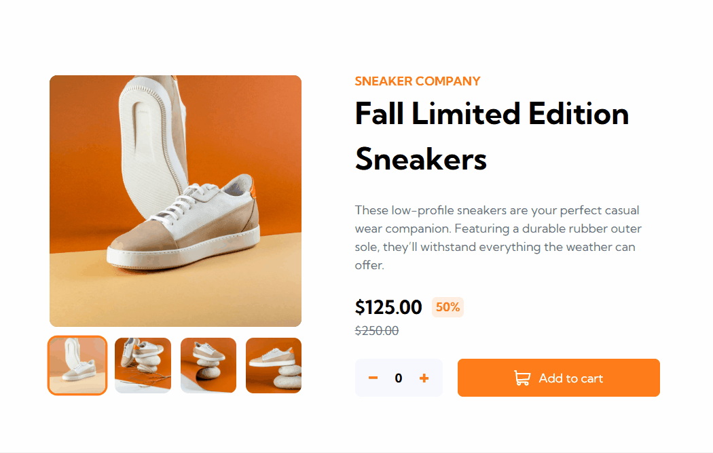
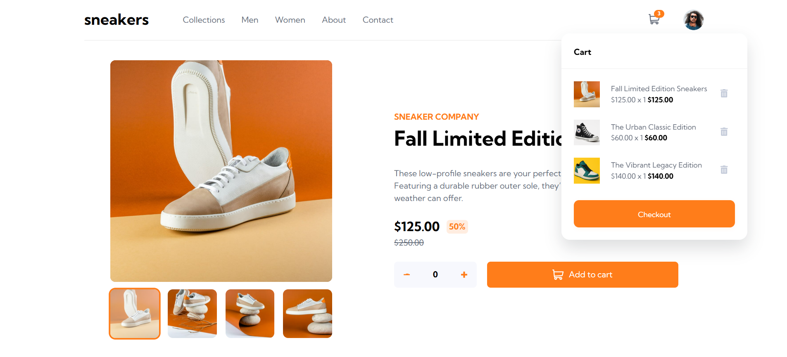
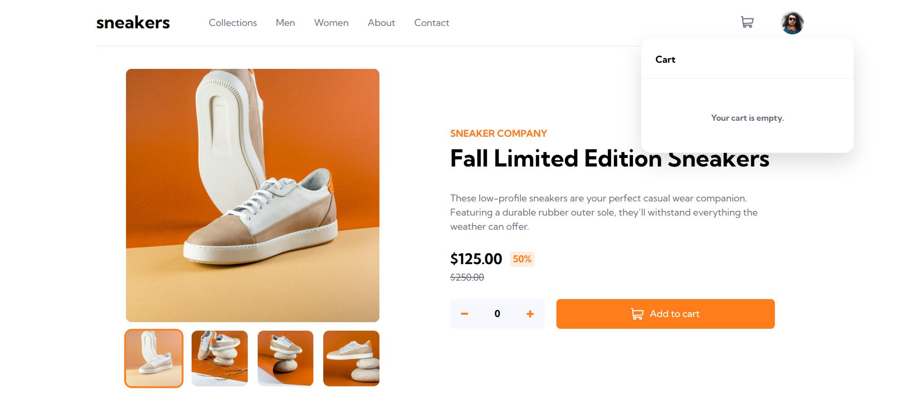

- Cart Interaction: 수량 조절(counter)과 장바구니 버튼(Add to Cart) 간의 상태를 props로 연결하여 직관적인 UX 구현
- State-based Cart Management: Zustand store를 활용해 상품 정보를 저장하고 관리. 새로 담는 상품은 객체로 추가하며, 중복된 상품은 해당 객체의 count 값을 갱신하여 수량을 누적
- Dynamic Badge Display: 장바구니 내 전체 상품 수량을 계산해 아이콘 상단에 실시간으로 숫자 뱃지를 표시, 사용자에게 현재 상태를 직관적으로 제공

 

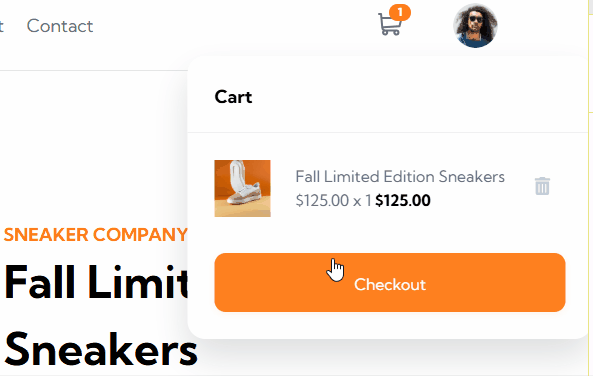

- Delete Item: store의 cart에서 해당 객체 제거

 
<strong>Image Popup & Slider Component</strong>

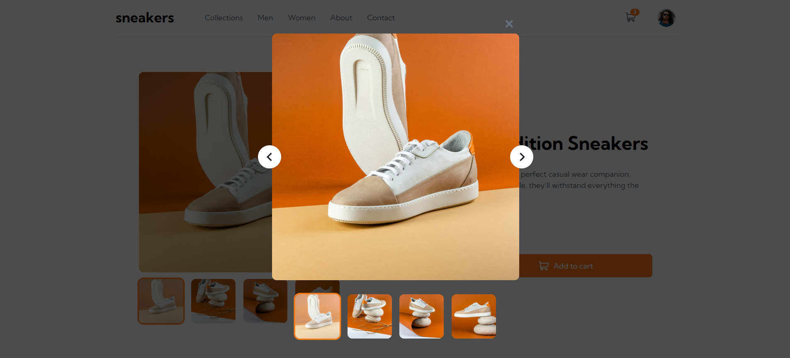

- Reusable Image Slider: 조건부 렌더링을 활용하여 슬라이더 화살표를 상황에 따라 노출하며, 팝업 컴포넌트가 상위일 경우 클릭을 방지해 UX 안정성 확보
- Responsive Styling: 선택된 컴포넌트에 따라 이미지의 크기 및 스타일을 동적으로 조정하여 시각적 피드백 제공
- Unidirectional Image Sync: 상세 페이지에서 클릭한 이미지를 팝업에 단방향으로 전달. 팝업 내 이미지 이동은 상세 페이지 상태에 영향을 주지 않도록 구성하여 컴포넌트 간 독립성 유지

 

#### -Mobile-

 

<strong>Product Detail Page(상세 페이지)</strong>

  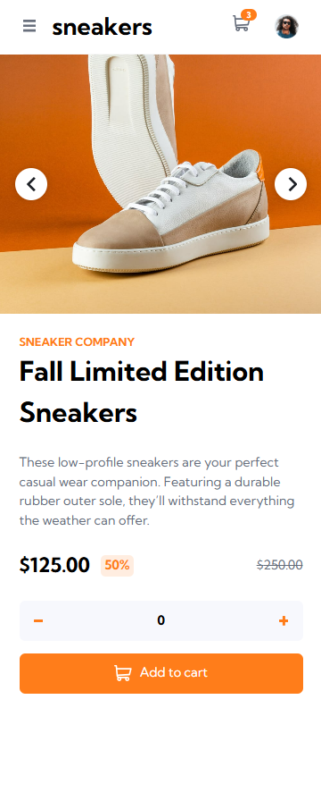
  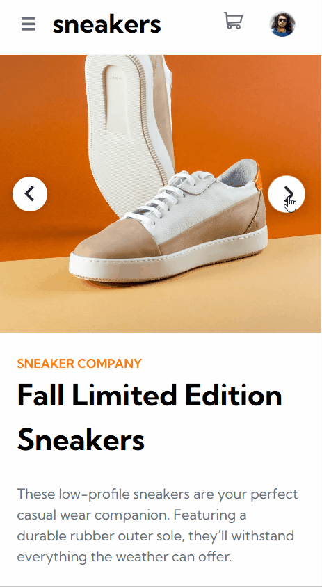

- Component-Level Responsiveness: Desktop과 Mobile 간의 UI 차이가 크기 때문에, 미디어 쿼리 대신 Mobile 전용 컴포넌트를 별도로 분리하여 유지보수성과 가독성 향상
- Viewport-based Branching: useMediaQuery 훅을 활용해 index.tsx에서 화면 크기에 따라 Desktop/Mobile 컴포넌트를 조건부 렌더링. 해당 분기 로직은 향후 리팩토링 시 재사용 가능한 Wrapper 컴포넌트로 분리 예정
- Shared State via Props Drilling: 이미지 슬라이드 상태를 Desktop과 Mobile 컴포넌트에서 동일하게 공유할 수 있도록 상위 컴포넌트(index.tsx)에서 props로 하향 전달하는 구조 설계

 

<strong>MenuOff-canvas Menu</strong>

  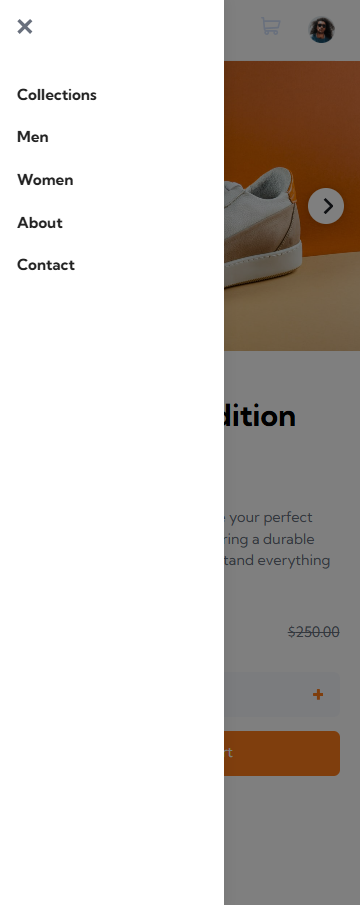
  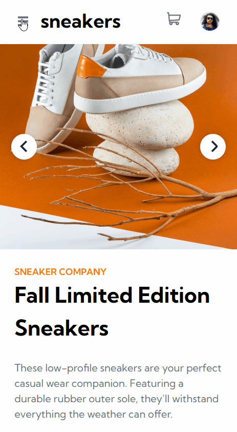

- Smooth Transition States: 메뉴의 여닫힘을 자연스럽게 표현하기 위해 open, closing, closed의 세 가지 상태 타입을 정의하고, 각 상태에 따라 조건부 스타일링을 적용하여 부드러운 전환 구현

- Delayed Unmounting Logic: setTimeout을 활용해 메뉴 닫힘 애니메이션이 완료된 후(250ms)에 실제 메뉴 데이터를 DOM에서 제거, 깔끔한 종료 UX 구현

 

<strong>Cart Popup</strong>

  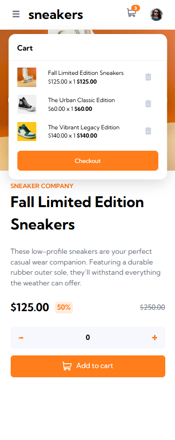
  

- Reusable Popup Component: Desktop에서 사용하던 Popup 컴포넌트를 동일하게 재사용하여 코드 중복을 줄이고 UI 일관성 유지

- Responsive Alignment: media query를 활용하여 화면 크기에 따라 위치 조정—Tablet 뷰포트에서는 오른쪽 정렬, Mobile 뷰포트에서는 중앙 정렬을 적용하여 기기별 최적화된 UX 구현

 

#### ETC

추가 상품 데이터를 렌더링한 디테일 화면  
(데이터 추가 목적: 향후 상품 리스트 페이지 구현 및 확장을 위한 것이며 상품명과 문구, 이미지는 ChatGPT로 생성하였습니다.)

 

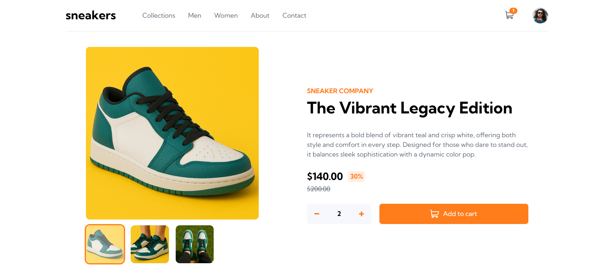
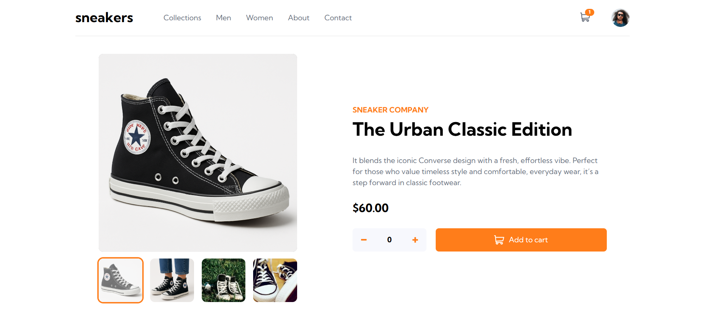

Links:

- [Product2](https://sneakers-by-oodhmo.netlify.app/men/detail/sn-002)
- [Product3](https://sneakers-by-oodhmo.netlify.app/men/detail/sn-003)

## 🛠️ My process

### Built with

- **Semantic HTML5** – Accessible and well-structured markup
- **SCSS (Sass)** – Modular and maintainable styling with variables and nesting
- **Flexbox & Grid** – Responsive layout structure
- **Responsive design** – Optimized for both desktop and mobile screens
- [**React**](https://reactjs.org/) - JS library
- [**Vite**](https://nextjs.org/) - Lightning-fast frontend build tool
- [**Typescript**](https://styled-components.com/) – Static typing for better code reliability
- [**React Router**](https://reactrouter.com/) – Declarative routing for React apps
- [**Zustand**](https://zustand-demo.pmnd.rs/) – Minimalistic state management library

 

### What I learned (배운 점과 고민)

이번 프로젝트를 통해 Vue와는 다른 React 생태계의 구조와 철학을 실무 관점에서 직접 다뤄볼 수 있었고, React 특유의 상태 관리 및 컴포넌트 구조 설계 방식에 대한 이해를 더욱 깊이 할 수 있었습니다.

- props drilling과 Context API의 사용을 구분하며 상황에 맞는 적절함을 비교 및 판단
- React hook의 의존성 배열 관리에서 발생할 수 있는 불필요한 렌더링/무한 루프 버그를 겪으며 Hook의 법칙을 배우고 적용함
- Custom hook 설계를 통해 중복된 비즈니스 로직을 분리하는 방식 시도, 적용 (이미지 동적 import 로직)
- Zustand로 전역 상태 관리 로직을 적용, 페이지 새로고침 이후 상태 유지를 위해 persist 미들웨어를 도입 (localStorage 사용)
- 팝업 UI 구현 시 createPortal을 활용해 루트 외부에 렌더링하는 방식 구현 (z-index 이슈)
- React Router 구조를 배우고 공통 경로 설계 등의 라우팅 전략 고민
- Vite 환경에서 동적 이미지 import를 구현하기 위해 **import.meta.glob**를 도입. 해당 기능이 정적 자산 로딩을 어떻게 최적화하는지 원리 파악.
- SVG를 일관된 컴포넌트로 다루고자 Vite + SVGR 조합을 사용. 아이콘 스타일링과 접근성을 함께 고려함.
- 디자인 분리 전략을 시도하며 로직과 스타일, 구조를 명확히 나눔. BEM의 개념을 참고해 구성을 따라가며 시도했지만 클래스 네이밍은 엄격한 규칙을 따르지 않음.
- Desktop, Mobile UI가 완전히 다르므로 유지보수 등의 측면을 고려해 Mobile/Desktop 분기 컴포넌트 구조를 설계.

 

### Continued development (앞으로의 개발 계획)

- Collection page (Main page)
  - 서버의 랜딩 페이지 역할
  - 구성 요소:
    - 배너(Hero section): 브랜드 또는 시즌 테마 강조
    - 사이트 소개(About): 간단한 브랜드/서비스 소개 문구
    - 상품 리스트:
      - Latest: 출시일 기준 정렬
      - Popular: 조회수/클릭수 기반 정렬
    - CTA: 지금 쇼핑하기/세일 바로가기 등

 

- Men / Women page
  - 성별에 따른 상품 리스트를 보여주는 페이지
  - 필터링 기준:
    - 상품의 `gender` 메타데이터 활용
  - 향후 추가할 수 있는 기능:
    - 가격, 최신순, 인기순 등 정렬 옵션
    - 무한 스크롤 또는 페이지네이션 (더 많은 데이터 추가 필요)

 

- Contact page
  - 사용자가 브랜드/운영자에게 연락할 수 있도록 하는 페이지
  - 구성 요소
    - 연락처 정보: 전부 예시 정보. 이메일, 전화번호, 운영 시간, 소셜 미디어 링크
    - 문의 폼:
      - 이름, 이메일, 메시지 입력 필드
      - 유효성 검사 포함한 전송 버튼
    - 지도 또는 주소 이미지: 임의의 주소가 있어야 하므로 구현 안 할 수도 있음.

 

- About page
  - 브랜드/프로젝트에 대한 소개를 제공하는 페이지. 브랜드 소개는 임의로 작성할 예정, 프로젝트 소개가 주가 되는 페이지일 듯 함.
  - 구성 요소:
    - 브랜드 소개: 간단한 브랜드/사이트 소개 문구
    - 프로젝트 배경: 프론트엔드 멘토 챌린지 기반이라는 점, 추가 기능 개발과 확장에 대한 배경 설명
    - 사용 기술 스택 설명: React, Vite, Zustand 등 기술뱃지
    - 개발자 정보: 이름, Github 링크 등

 

### Useful resources (참고 자료)

- [React Learn](https://ko.react.dev/learn) - 전반적인 React 문법 참고
- [Vite Docs](https://vitejs.dev/guide/) - Vite
- [Vite Guide - glob 패턴](https://ko.vite.dev/guide/features#glob-import) - 여러 모듈을 한 번에 가져올 수 있는 동적 import 패턴 참고
- [Zustand Guide](https://zustand.docs.pmnd.rs/getting-started/introduction) - Zustand 문법 참고, 전반적 이해
- [SVGR](https://react-svgr.com/docs/what-is-svgr/) - svg 아이콘 사용을 위한 적용 방법, 스타일 참고

 

## 🧠 Acknowledgments

- [Frontend Mentor](https://www.frontendmentor.io) - 프론트엔드를 주도적으로 설계, 개발할 수 있도록 프로젝트 별로 디자인과 가이드를 제공하는 플랫폼

- 이 프로젝트는 공식 문서, 개발 블로그, 그리고 AI 도구(ChatGPT)를 참고하며 진행했습니다.  
  특히 상태 관리 구조 설계와 커스텀 훅 패턴 검증 과정에서 AI의 도움을 받아 최적화, 오류 해결 방향을 빠르게 탐색하고 직접 테스트해 적용했습니다.
